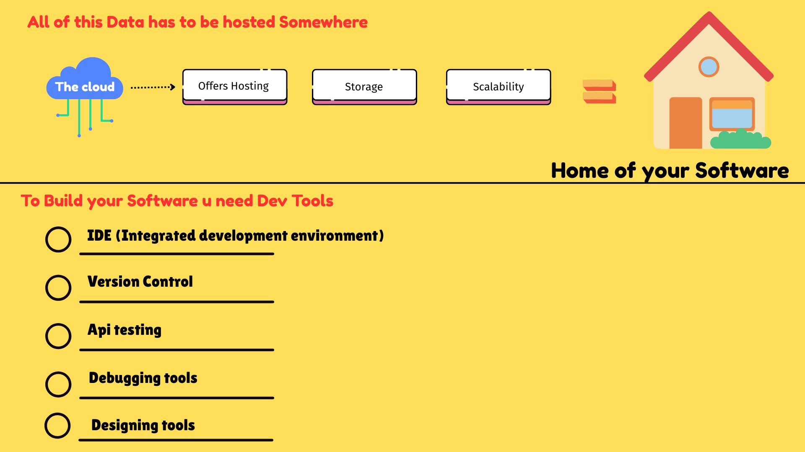

🧠 School Studies: From 0 to Hero
📘 My Course: (Software Engineering / Programming)

1️⃣-------------------🎯 Purpose / Value of the Course-------------

        🧩 Develop problem-solving skills
        💡 Build my own ideas (Apps, Websites, Games)
        🌍 Solve global challenges
        🏠 Enable smart living
        💼 Create financial opportunities

2️⃣-------------------🔧 How Software Engineering Shows This Value---------------

        📱 Build Applications
        🧠 Create Systems (e.g., life-saving systems)
        🏢 Improve businesses:
                              1:By creating management systems
                              2:Inventory/Manager tools
        🚀 Launch Startups (e.g., Facebook)
        📚 Make Learning Accessible
                              1:LMS (Learning Management Systems)
                              2:Online Courses, Web Apps, Websites
        🌍 Contribute to Open Source  e.g., Linux, Google, ChatGPT
        📱 Design Smart Devices ----> Phones, Watches, Fridges, etc.
        📊 Support Research ------->  Through Data Analysis

3️⃣---------------------How Does Software Do All This❓-----------------------

        🌟Software engeneering is made up of 9 components and by use of these components its real
           value is achieved
           They are ➡️
                      (a) Hardware
                      (b) Os [operating system]
                      (c) Languages [programming languages]
                      (d) Developer tools [dev tools]
                      (e) FrontEnd
                      (f) BackEnd
                      (g) Api's  [Application programming interface]
                      (h) DataBase [Db's]
                      (i) Cloud Services
    
           in Overview they talk i will show u what each talks about:
    
            1. 🖥️ Hardware
    
                      💠Definition: The physical components of a computer system.
                      📍Examples:
                               CPU (Central Processing Unit)
                               RAM (Random Access Memory)
                               Storage (SSD/HDD)
    
            2. 💽 Operating System (OS)
                      💠Definition: The interface between hardware and software — allows user interaction with the system.
                      📍Examples:
                              Windows
                              Linux
                              macOS
    
            3. 🧑‍💻 Programming Languages
                     💠Definition: Tools used to write instructions for computers to execute.
                     📍Examples:
                              Python
                              JavaScript
                              Java
                              C/C++
                              Go
                              Rust
    
            4. 🎨 Frontend (User Interface)
                     💠Definition: The part of the software the user interacts with — responsible 
                        for design and user experience.
                     📍Technologies:
                              HTML
                              CSS
                              JavaScript
                              Frameworks: React, Vue, Angular
    
            5. 🧠 Backend (Logic, Database, Server)
                     💠Definition: The behind-the-scenes logic that handles requests, data processing, and responses.
                     📍Examples:
                              Languages: Node.js, PHP, Java, Python (Django/Flask)
                              Servers: Apache, Nginx
                              Handles API responses, user authentication, database operations
    
            6. 🔁 APIs (Application Programming Interfaces)
                     💠Definition: A way for different software components or systems to communicate.
                     ❓Purpose:
                              Connects frontend to backend
                              Enables third-party integrations
                     📍Examples:
                              REST
                              GraphQL
                              JSON & XML formats
    
            7. 🗄️ Databases
                     💠Definition: Store, retrieve, and update application data.
                     📍Types:
                              SQL (Relational): Uses tables (e.g., MySQL, PostgreSQL, SQLite)
                              NoSQL (Non-Relational): Uses key-value pairs or documents (e.g., MongoDB, Firebase Realtime DB)
    
            8. ☁️ Cloud Services
                     💠Definition: Platforms that provide on-demand computing resources, storage, 
                        and hosting for applications.
                     📍Examples:
                              Amazon Web Services (AWS)
                              Google Cloud Platform (GCP)
                              Microsoft Azure
                              Firebase
    
                     👍Benefits: 
                              Scalability, 
                              cost-efficiency, 
                              easy deployment
    
            9. 🛠️ Development Tools (Dev Tools)
                     💠Definition: Tools that help in building, testing, debugging, and managing code.
                     📍Categories & Examples:
                            🔃 Version Control:  Git, GitHub, GitLab, Bitbucket
                            🧪 API Testing:      Postman, Thunder Client
                            🐞 Debugging Tools:  Chrome DevTools, Firefox Developer Tools

4️⃣---------------------------------How They all connects --------------------------------->
     *Knowing these components separately is main but the purpose of this whole course is knowing how
      they connect and the things you can make when they connect , think of it as a puzzle, these 9 are the pieces , and with them you can make any puzzle u want.

                  Hardware contains the CPU which has the OS.
                                        |
                                        |
                  The Os runs code witten in a language from a Dev tool 
                                        |
                                        |
                  The hardware (monitor) displays the code results or error in the monitor
                                        |
                                        |
                  The displayed result is now the Frontend it allows user to interact
                                        |
                                        |
                  User interacts with Frontend and Does something 
                                        |
                                        |
                  The user request is sent to the Backend server using API's
                                        |
                                        |
                  The server recieves the request and processes it and talsk to the Db using API's       
                                        |
                                        |
                  The Db processes what the server needs
                                        |
                                        |
                  either (Store , Update , Retrieve , Delete)     
                                        |
                                        |
                  Db sends back the desired result to Server 
                                        |
                                        |
                  Server sends the result or the error to the frontend where the user sees it.
                                        |
                                        |
                  All of this is hosted in the cloud for everyone to see
                                        |
                                        |
                  Any changes to the Development phase has to be managed by using version control.                      

** A diagram explaining this is found in the folder [How they all connect.jpg]

             
             
